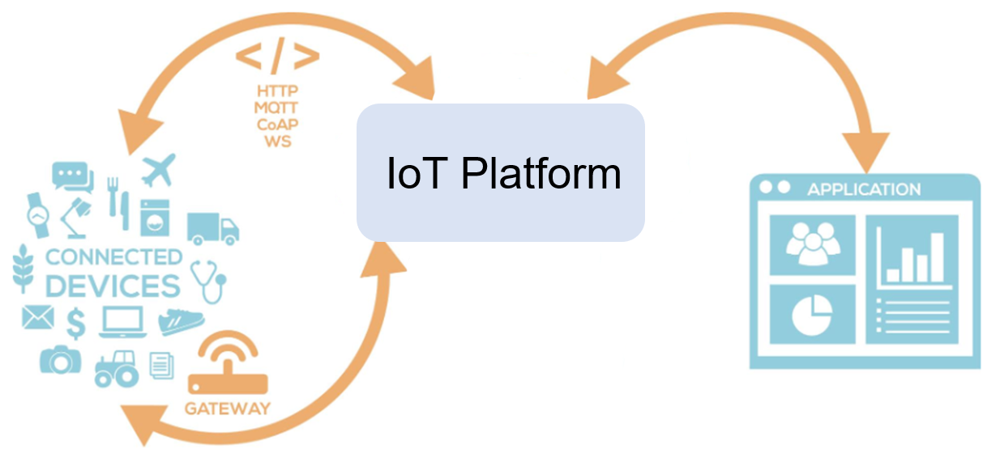
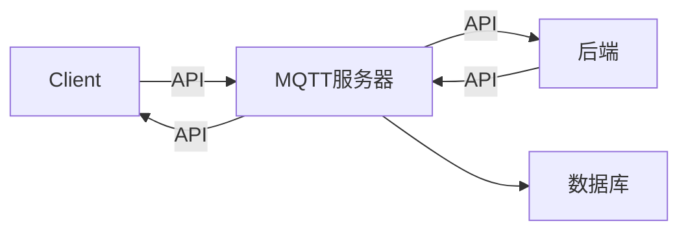
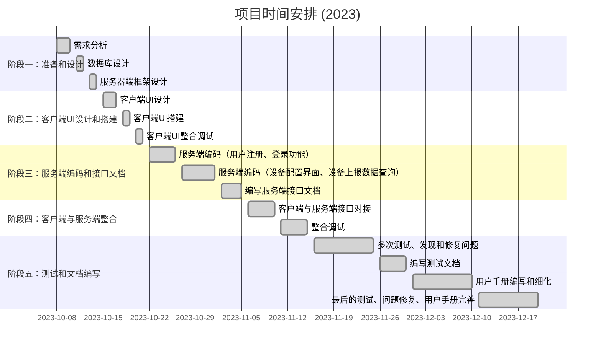

# IoT 物联网设备管理平台


功能全部实现，文档写认真一点就可以满绩，最后一节课去验收的还能拿到接近满分，稍微差点功能或者前端比较难看或者文档写的不详细就会扣分，另外代码不要抄袭，听说可能会查重

#####  所需环境

+ [Node.js](https://nodejs.org/en/download)

+ [python3.x]( https://www.python.org/getit/)

+ [MySQL80](https://dev.mysql.com/downloads/mysql/)

+ [mosquitto](https://mosquitto.org/download/)

  + mosquitto需要进行一定的配置，教程请见[这里](https://www.cnblogs.com/dissun/p/10505007.html)

+ [maven](https://maven.apache.org/download.cgi)



## 前端

使用nvm来控制nodejs版本(需要降低版本来和Vue版本对应)与前端的React框架对应

```shell
nvm install 14
nvm use 14
```

然后用yarn来运行前端

```shell
# frontend
rm -rf node_modules
rm yarn.lock
yarn install
yarn serve

# debug
yarn lint
```


react (nodejs>=16) 17，18也要报错

npm install react-leaflet leaflet --legacy-peer-deps

nvm use 19

npm update --save-dev eslint prettier @typescript-eslint/parser @typescript-eslint/eslint-plugin eslint-plugin-react eslint-plugin-react-hooks eslint-plugin-promise

## 后端

```shell
# backend
pip install -r requirements.txt
# 如果报错缺乏14安装工具， python -m pip install --upgrade pip
```

[解决14构建工具错误](https://blog.csdn.net/u012637358/article/details/123214825)


使用`mysql workbench`打开`../build`文件夹中的`create.sql`文件，执行建表

```
账号 bs
密码  bsbs
root bsbs
```

用pycharm打卡整个工程

+ 配置好运行环境运行`backendServer.py`，运行在`localhost:5000`

```shell
# 运行mqttServer.py之前要先运行下列语句打开服务(Eclipse Mosquitto是一个流行的开源MQTT服务器软件)
mosquitto
```

+ 再开启一个终端，运行`mqttServer.py`，准备监听client信息

#### 3. Client虚拟信息发送

+ IDEA打开project并`cd client`
+ `mvn clean install`，生成target文件夹
+ `cd target`，进入`target`文件夹，输入`java -jar iotclient-1.0.0.jar`
+ Client消息已经成功发送


此时就可以在本机前端进行一系列操作了，详见**用户手册**

## TODO

注册功能还有点问题

编辑修改的那个按钮还有问题，修改的内容并不能被成功保存

增加一个管理员模式登录的按钮


🙅‍2023年11月13日前提交

**设计文档**

占20%最终总评成绩。打包上传学在浙大或发送到hu_xj@zju.edu.cn


🙅‍2024年1月5日前提交： 

1、程序代码和实验报告。 

2、**制作一个docker容器，包含运行网站所需的软件** 

3、录制一个功能演示的操作视频

4、提交的文档包括： 

（1）实验报告封面 （见下页） 

（2）**设计文档** 

（3）其他文档（如**使用手册**、**测试报告**、**开发体会**、**小结**等）， 

（4）源代码文件 

打包上传学在浙大或发送到hu_xj@zju.edu.cn


## 原始

#### 文档详见report文件夹

+ 用户手册、运行指南手册、接口文档等文档
+ 文档内有安装、配置、启动、使用的全套说明
+ 附上了相关接口文档，方便后续改善部分功能
+ 附上了中期提交的设计报告，最终实现功能有所完善

#### 建表文件详见build文件夹

+ `create.sql`文件即为本次的数据库建表文件

#### 相关技术栈

+ 前端：Vue
+ 后端：Python+flask
+ 客户端：基于老师提供的iotclient进行微调

 

为了提交作业方便，项目使用的数据库，建议使用mysql或mangodb，提交作业时同时附带建库建表的脚本文件或数据。 




时间安排


