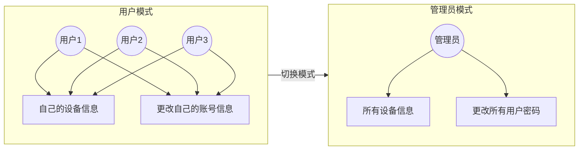
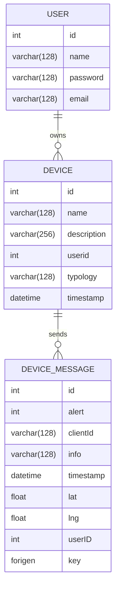
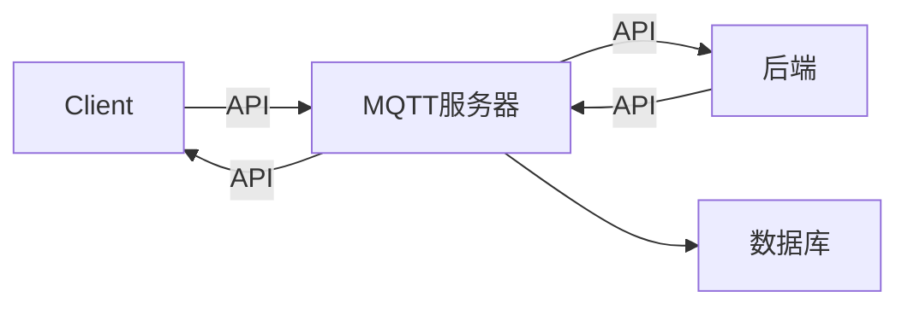
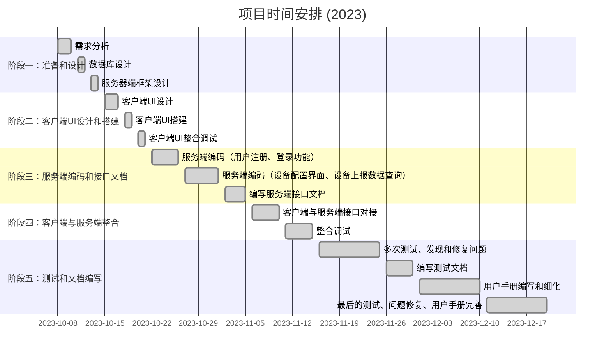

# IoT

### Demo


密码如下所示，具体支持的操作详见**用户手册**

```shell
普通用户密码都是zhouwei
root用户密码是root
```

**或者**可以使用我提供的docker(它由`docker-compose up -d`生成后打包)

```shell
# 把docker_image.zip解压后的文件夹下的镜像都load
docker load < mysql_latest.tar
docker load < eclipse_mosquitto_latest.tar
docker load < iot_python.tar
docker load < iot_java.tar
docker load < nginx_latest.tar
# 解压IoT后在IoT目录下执行
docker-compose up -d
```

### 文档目录

```shell
├── IoT
│   └── backend
│       ├── flask_server #头文件
│       ├── iot_backend  #前端的后端
│       ├── mqtt_backend  #客户端的后端
│       └── ...
│   ├── client  # 老师提供的客户端，主要的修改见报告，不再赘述
│       └── ...
│   ├── mqtt
│       └── mosquitto.conf
│   └── react
│       ├── build #yarn build生成的静态文件
│       ├── src   #该目录下为主要的前端代码
│       	└── ...
```

### 开发历程

#### 模式设计



#### SQL & ER图



#### 整体架构



#### 时间安排



