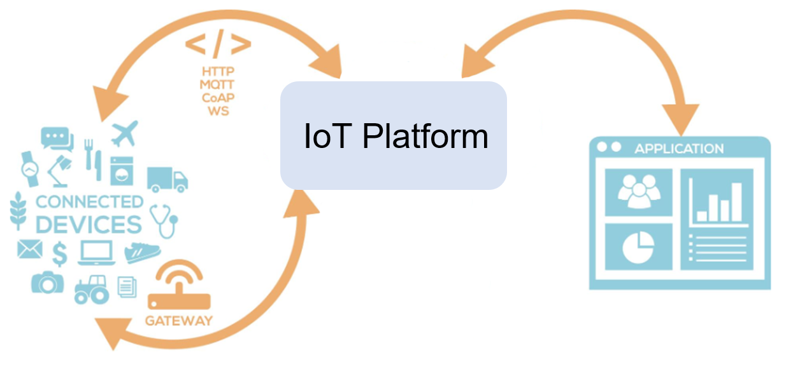
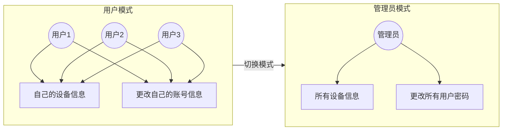
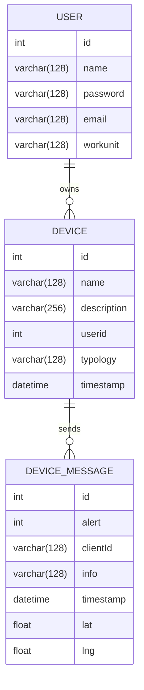
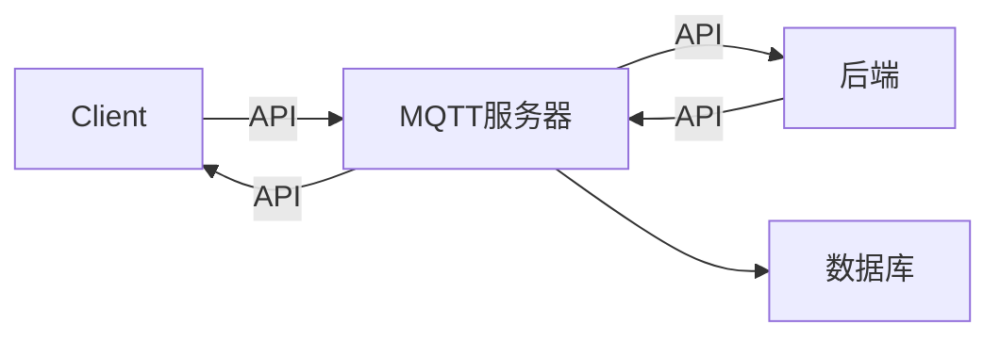
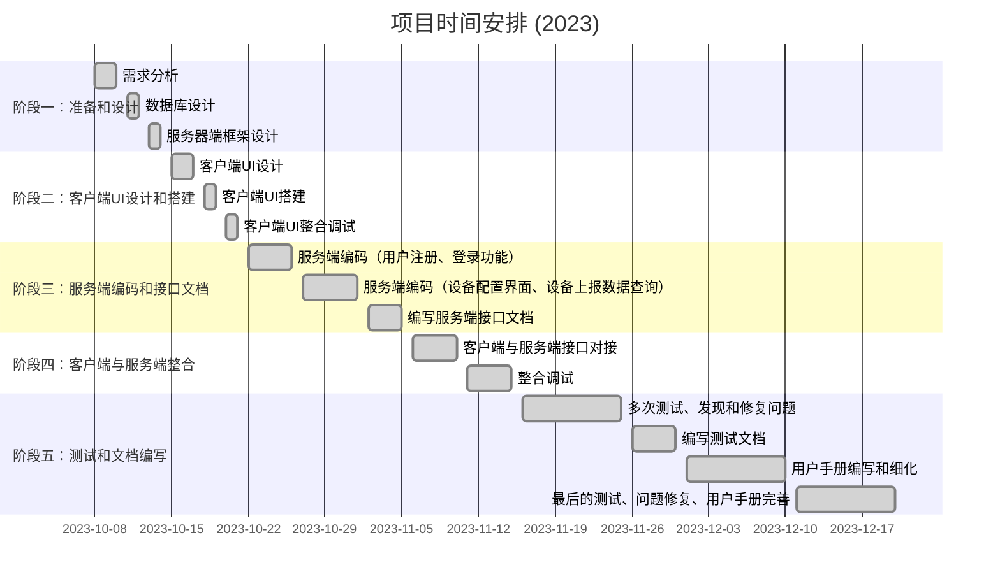

# IoT 物联网设备管理平台



## 前端

```shell
nvm install 19
nvm use 19
```

然后用yarn来运行前端

```shell
# frontend
rm -rf node_modules
rm yarn.lock
yarn install
# 第一次之后直接进入react目录运行就行
yarn start
```

如果报错可能需要运行

```shell
npm install react-leaflet leaflet --legacy-peer-deps

npm update --save-dev eslint prettier @typescript-eslint/parser @typescript-eslint/eslint-plugin eslint-plugin-react eslint-plugin-react-hooks eslint-plugin-promise
```

## 后端

```shell
# backend
pip install -r requirements.txt
# 如果报错缺乏14安装工具， python -m pip install --upgrade pip
```

[解决14构建工具错误](https://blog.csdn.net/u012637358/article/details/123214825)

使用`mysql workbench`打开`init.sql`文件，执行建表

```
账号 bs
密码  bsbs
root bsbs
```

用pycharm打卡整个工程

+ 配置好运行环境运行`backendServer.py`，运行在`localhost:3790`

```shell
netstat -ano | findstr :1883
taskkill /F /PID 5748
# 运行mqttServer.py之前要先运行下列语句打开服务(Eclipse Mosquitto是一个流行的开源MQTT服务器软件)
mosquitto
```

+ 再开启一个终端，运行`mqttServer.py`，准备监听client信息

#### 3. Client虚拟信息发送

由老师提供，几乎没有进行更改

```shell
# 首先要运行后端程序
mvn clean package
# 同时复制一份iot道target
cd target
java -jar iotclient-1.0.0.jar
```


此时就可以在本机前端进行一系列操作了，详见**用户手册**

```
普通用户密码都是zhouwei
root用户密码是root
```


## TODO

报告写完

然后试一下部署在网页上

1. 使用 [Zeabur](https://zeabur.com/home/) 进行一站式、全自动的项目部署，且自带 CI/CD 和 SSL 证书

2. 华为云学生端

最后录一个视频


🙅‍2024年1月5日前提交： 

1、程序代码和实验报告。 

2、**制作一个docker容器，包含运行网站所需的软件** （docker只能运行一个软件，不知道这个什么意思）

3、录制一个功能演示的操作视频

4、提交的文档包括： 

（2）里面的文档

（4）源代码文件（包括sql） 

打包上传学在浙大


### 文档梗概


**开发文档和环境配置**：  主要记录了我的一些开发过程，以及有详细的环境配置教程


#### 模式设计



#### SQL & ER图



#### 整体架构



#### 时间安排



# 关于docker打包

我要如何把下列仓库https://github.com/Llux-C/IoT所示内容需要的环境(比如python， mysql， nodejs)一起用docker打包 已经知道我本地已经能正常运行该程序，我要如何把本地的环境用docker打包

2 / 2

ChatGPT

ChatGPT

要将一个项目及其所需环境（如Python、MySQL、Node.js等）使用Docker进行打包，您需要创建一个Dockerfile和一个docker-compose.yml文件（如果需要管理多个容器）。以下是基本步骤：

### 1. 创建 Dockerfile

Dockerfile 是一个文本文件，包含了从一个基础镜像创建新镜像的所有命令。您的项目需要Python、MySQL和Node.js，所以您可能需要创建多个 Dockerfile，每个针对一个特定的环境。例如，对于Python环境：

```
DockerfileCopy code# 使用Python官方镜像作为基础镜像
FROM python:3.8

# 设置工作目录
WORKDIR /app

# 将本地代码复制到容器内
COPY . /app

# 安装所需依赖
RUN pip install -r requirements.txt

# 运行应用
CMD ["python", "./your-app.py"]
```

对于Node.js和MySQL，您可以类似地创建Dockerfile。

### 2. 创建 docker-compose.yml

当您需要同时运行多个容器时，docker-compose.yml 文件会非常有用。这个文件定义了如何运行您的服务。

```
yamlCopy codeversion: '3'
services:
  web:
    build: ./path-to-your-nodejs-app
    ports:
      - "3000:3000"
  python-app:
    build: ./path-to-your-python-app
    volumes:
      - .:/app
  db:
    image: mysql
    environment:
      MYSQL_ROOT_PASSWORD: example
```

这个文件定义了三个服务：Node.js应用、Python应用和MySQL数据库。

### 3. 构建和运行容器

在拥有Dockerfile和docker-compose.yml文件后，您可以使用以下命令来构建和运行容器：

```
bashCopy code
docker-compose up --build
```

这将根据Dockerfile中的指令构建镜像，并根据docker-compose.yml中的定义启动服务。

### 注意事项

- **依赖管理**：确保您的应用程序依赖在容器内被正确安装。
- **环境变量**：如果您的应用程序需要环境变量，您需要在Dockerfile或docker-compose.yml文件中设置。
- **端口映射**：确保docker-compose.yml文件中正确设置了端口映射，以便可以从外部访问容器内的应用程序。
- **数据持久化**：对于数据库服务，您可能需要设置卷来持久化数据。

在执行这些步骤时，您可能需要根据项目的具体需求做出调整。
