# IoT 物联网设备管理平台


## 前端

```shell
nvm install 19
nvm use 19
```

然后用yarn来运行前端

```shell
# frontend
rm -rf node_modules
rm yarn.lock
yarn install
# 第一次之后直接进入react目录运行就行
yarn start
```

如果报错可能需要运行

```shell
npm install react-leaflet leaflet --legacy-peer-deps

npm update --save-dev eslint prettier @typescript-eslint/parser @typescript-eslint/eslint-plugin eslint-plugin-react eslint-plugin-react-hooks eslint-plugin-promise
```

## 后端

```shell
# backend
pip install -r requirements.txt
# 如果报错缺乏14安装工具， python -m pip install --upgrade pip
```

[解决14构建工具错误](https://blog.csdn.net/u012637358/article/details/123214825)

使用`mysql workbench`打开`init.sql`文件，执行建表

```
账号 bs
密码  bsbs
root bsbs
```

用pycharm打卡整个工程

+ ==配置好运行环境运行`backendServer.py`，运行在`localhost:3790`==

```shell
netstat -ano | findstr :3306
taskkill /F /PID 5748
# 运行mqttServer.py之前要先运行下列语句打开服务(Eclipse Mosquitto是一个流行的开源MQTT服务器软件)
mosquitto
```

+ 再开启一个终端，运行`mqttServer.py`，准备监听client信息

#### 3. Client虚拟信息发送

由老师提供，几乎没有进行更改

```shell
# 首先要运行后端程序
mvn clean package
# 同时复制一份iot道target
cd target
java -jar iotclient-1.0.0.jar
```


此时就可以在本机前端进行一系列操作了，详见**用户手册**

```
普通用户密码都是zhouwei
root用户密码是root
```


## TODO

然后试一下部署在网页上或者Docker打包

1. 使用 [Zeabur](https://zeabur.com/home/) 进行一站式、全自动的项目部署，且自带 CI/CD 和 SSL 证书

2. 华为云学生端

最后录一个视频


🙅‍2024年1月5日前提交： 

1、程序代码和实验报告。 

2、**制作一个docker容器，包含运行网站所需的软件** （docker只能运行一个软件，不知道这个什么意思）

3、录制一个功能演示的操作视频

4、提交的文档包括： 

（2）里面的文档

（4）源代码文件（包括sql） 

打包上传学在浙大


### 文档梗概


**开发文档和环境配置**：  主要记录了我的一些开发过程，以及有详细的环境配置教程


#### 模式设计

```mermaid
graph LR
    subgraph 用户模式
        用户1((用户1))
        用户2((用户2))
        用户3((用户3))
        用户1 --> 自己的设备信息
        用户2 --> 自己的设备信息
        用户3 --> 自己的设备信息
        用户1 --> 更改自己的账号信息
        用户2 --> 更改自己的账号信息
        用户3 --> 更改自己的账号信息
    end

    subgraph 管理员模式
        管理员((管理员))
        管理员 --> 所有设备信息
        管理员 --> 更改所有用户密码
    end

    用户模式 -->|切换模式| 管理员模式

```

#### SQL & ER图


#### 整体架构

```mermaid
graph LR

  Client[Client] -->|API| A{云}
  A{云} -->|API| Client[Client]
  A{云} -->|API| Satellite[后端]
  Satellite[后端] -->|API| A{云}
  A[MQTT服务器]
  A-->B[数据库]

```



#### 时间安排

```mermaid
gantt
    title 项目时间安排 (2023)
    dateFormat YYYY-MM-DD
    section 阶段一：准备和设计
    需求分析 :done, 2023-10-08, 2023-10-10
    数据库设计 :done, 2023-10-11, 2023-10-12
    服务器端框架设计 :done, 2023-10-13, 2023-10-14

    section 阶段二：客户端UI设计和搭建
    客户端UI设计 :done, 2023-10-15, 2023-10-17
    客户端UI搭建 :done, 2023-10-18, 2023-10-19
    客户端UI整合调试 :done, 2023-10-20, 2023-10-21

    section 阶段三：服务端编码和接口文档
    服务端编码（用户注册、登录功能） :done, 2023-10-22, 2023-10-26
    服务端编码（设备配置界面、设备上报数据查询） :done, 2023-10-27, 2023-11-01
    编写服务端接口文档 :done, 2023-11-02, 2023-11-05

    section 阶段四：客户端与服务端整合
    客户端与服务端接口对接 :done, 2023-11-06, 2023-11-10
    整合调试 :done, 2023-11-11, 2023-11-15

    section 阶段五：测试和文档编写
    多次测试、发现和修复问题 :done, 2023-11-16, 2023-11-25
    编写测试文档 :done, 2023-11-26, 2023-11-30
    用户手册编写和细化 :done, 2023-12-01, 2023-12-10
    最后的测试、问题修复、用户手册完善 :done, 2023-12-11, 2023-12-20

```



```shell

docker volume rm iot_db-data
docker-compose up -d

# 重新生成
docker-compose down
docker-compose up -d --build


docker save -o E:\IoT iot-java

sudo lsof -i :3002
```


接口问题

```
net stop WinNAT
```

```
net start WinNAT
```


我有一个服务器150.158.11.134，我通过docker部署了如下程序，为什么我不能通过150.158.11.134:3002访问网页？

已经知道我有docker-compose.yml内容如下,我用docker-compose up -d生成并运行了容器

```
version: '3'
services:
  mysql:
    container_name: mysql3790
    image: mysql:latest
    ports:
      - "3307:3306"
    environment:
      MYSQL_ROOT_PASSWORD: bsbs
    volumes:
      - ./init.sql:/docker-entrypoint-initdb.d/init.sql
      - db-data:/var/lib/mysql

  mqtt:
    container_name: mqtt3790
    image: eclipse-mosquitto:latest
    ports:
      - "1883:1883"
    volumes:
      - ./mqtt/mosquitto.conf:/mosquitto/config/mosquitto.conf

  python:
    container_name: python3790
    build:
      context: ./backend
    ports:
      - "3790:3790"
    environment:
      - DB_HOST=mysql3790
      - MQTT_HOST=mqtt3790
    depends_on:
      - mysql
      - mqtt

  java:
    container_name: java3790
    build:
      context: ./client
    ports:
      - "8080:8080"
    environment:
      - MQTT_HOST=tcp://mqtt3790:1883
    depends_on:
      - mysql
      - mqtt

  react:
    container_name: react3790
    image: nginx:latest
    volumes:
      - ./react/build:/usr/share/nginx/html
      - ./react/build/nginx.conf:/etc/nginx/conf.d/default.conf
    ports:
      - "3002:80"  # 将主机的 3002 端口映射到容器的 80 端口(nginx 默认端口)
    depends_on:
      - python

volumes:
  db-data:
```

其中nginx.conf内容为

```
server {
    listen       80;
    server_name  localhost;

    location / {
        root   /usr/share/nginx/html;
        index  index.html index.htm;
        try_files $uri /index.html;
    }

    error_page   500 502 503 504  /50x.html;
    location = /50x.html {
        root   /usr/share/nginx/html;
    }
}
```


