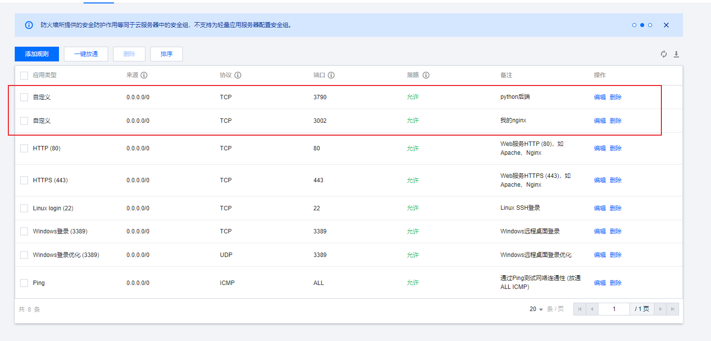

# 注意事项

把这个文件夹的名字改为build，其他啥都不用改（其他文件都不用动）

然后传到服务器http://150.158.11.134/在docker compose就可以执行所有功能了


主要的不同是

- nginx.conf进行了修改
- build是通过搜索替换了所有的localhost为150.158.11.134来完成的


服务器的docker和本地docker不同的地方需要按上述两点来更改，因为不再是通过localhost来访问了

另外切记要在服务器的防火墙处开启3790和3002两个端口，允许用户在否则后端和前端会出现问题



# 关于服务器部署

只需要鱼香ros一键下载docker

然后有其他报错就gpt照着改一下

唯一和本地docker不同的地方就是上面的注意事项

另外需要注意测试的时候如果要重新生成，一定要先删除需要改变的那个docker的image，否则不会刷新iamge的配置！！！

可以用类似于下面的办法，另外就是每次命令都用sudo否则可能权限有点问题

```shell
sudo docker stop react3790
sudo docker images
sudo docker rmi -f [ID]
```

